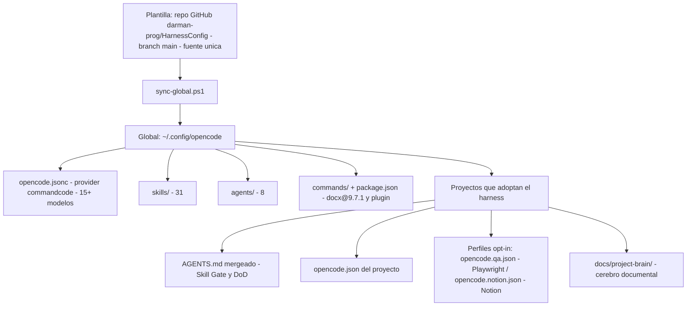
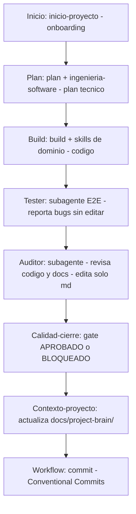

# Auditoría del Harness OpenCode — v2

> **Fecha:** 2026-09-18 · **Versión:** 2 · **Estado:** LISTO (con 1 pendiente menor)
> **Nota sobre la v1:** la auditoría v1 se perdió en una limpieza anterior (fue creada antes de versionar la plantilla en git y no sobrevivió). Este documento la reemplaza por completo; la comparación "Cambios desde v1" se basa en el registro de la sesión.
> **Para quién:** dev junior con TDAH. Secciones cortas, tablas y diagramas. Leer en 5 min.

---

## 1. Cambios desde v1

| Qué cambió | Antes (v1) | Ahora (v2) |
| --- | --- | --- |
| Skills | 16 | **31** (+15: calidad, producto, operación, diseño par, manuales) |
| Agentes | 6 | **8** (+`quality`, +`debugger`) |
| `tester` | agente principal | movido a **subagente** (E2E delegable) |
| Alcance de skills | solo proyecto local | **globalizadas** en `~/.config/opencode/skills/` |
| Sincronización | copia manual | **`sync-global.ps1`** (plantilla → global, reiniciar TUI después) |
| Control de versiones | sin repo | repo git en GitHub: **darman-prog/HarnessConfig**, branch `main`, 3 commits |
| MCP servers | mezclados en config global | **NO globalizados** (decisión final): Playwright y Notion en perfiles opt-in por proyecto |
| `uso-eficiente` | skill larga | **slim 47 líneas**, detalle movido a `references/TOKEN-SAVING.md` |

---

## 2. Inventario de skills (31)

Todas viven en la plantilla (`.opencode/skills/`) y se sincronizan a `~/.config/opencode/skills/`.

**Cómo leer la tabla:** "Señal" = lo que aparece en tu tarea → carga la skill con la tool `skill`. Activación: 🔄 = transversal (siempre), 🎯 = dominio (según tarea), ✋ = manual (solo si el usuario la pide).

### Transversales (siempre) 🔄
| Skill | Señal de carga |
| --- | --- |
| `uso-eficiente` | Toda tarea. Slim 47 líneas; detalle en `references/TOKEN-SAVING.md` |
| `workflow` | Commits, ramas, PRs, cierre |

### Backend / datos 🎯
| Skill | Señal de carga |
| --- | --- |
| `arquitectura` | Ubicar/diseñar capas, features, dominio (SOLID+DDD) |
| `base-datos` | Esquema, migraciones, seeds, índices, FKs |
| `convenciones-backend` | Endpoints, errores, DTOs, servicios (detalle en `references/CONVENCIONES-BACKEND.md`) |
| `contratos-api` | DTO o error nuevo, versionado |
| `microservicios` | Sistemas distribuidos, Saga, Outbox, CQRS |
| `seguridad` | Auth, inputs, secretos, CORS (cubre frontend+auditoría) |
| `observabilidad` | Logs, métricas, trazas, alertas |

### Frontend / diseño 🎯
| Skill | Señal de carga |
| --- | --- |
| `convenciones-frontend` | Componentes, servicios HTTP, estados UI, WCAG base |
| `ui-ux` | Cambios UI visibles (criterios en `references/CRITERIOS-UI-UX.md`) |
| `accesibilidad` | A11y profunda: modales, teclado, lectores de pantalla |

### Calidad 🎯
| Skill | Señal de carga |
| --- | --- |
| `testing` | Escribir/revisar tests (TDD+perf+mocking) |
| `tdd` | Lógica compleja paso a paso (driver/navigator) |
| `debugging` | Bug no trivial, causa raíz |
| `refactoring` | Refactor seguro, deuda técnica |
| `code-quality` | Smells, métricas, DRY/KISS/SOLID |
| `performance` | Queries lentas, caching, bundle |
| `calidad-cierre` | Gate final APROBADO/BLOQUEADO (checklist en `references/GATE-FINAL.md`) |

### Producto / onboarding 🎯
| Skill | Señal de carga |
| --- | --- |
| `inicio-proyecto` | Onboarding **sin copia local**: solo `opencode.json` + merge de `AGENTS.md` + PRODUCT/DESIGN + `docs/project-brain/` |
| `contexto-proyecto` | Cerebro documental `docs/project-brain/` (INDEX-TEMPLATE + UPDATE-RULES) |
| `criterio-producto` | Alcance, prioridades, trade-offs |
| `planeacion-proyectos` | Roadmap, MVP, hitos, backlog |
| `ingenieria-software` | Plan técnico, dependencias, spike/POC |

### Operación 🎯
| Skill | Señal de carga |
| --- | --- |
| `despliegue` | Deploy, pipeline, rollback, ambientes |
| `infraestructura` | Docker, compose, IaC, backups, DR |
| `documentacion` | READMEs, ADRs, specs, guías |

### Diseño UI (par, se cargan juntas) 🎯
| Skill | Señal de carga |
| --- | --- |
| `impecable` | Wrapper del CLI `npx impeccable` (flujo/integración) |
| `impeccable` | Ejecución de diseño oficial (polish/critique/audit) |

### Manuales (solo invocación explícita) ✋
| Skill | Señal de carga |
| --- | --- |
| `habilidades-ofimaticas` | Usuario invoca "ofimática". Sub-ruta `informe-docx` (kit docx-js A4/20mm; paquete `docx@9.7.1` en global, probado con smoke test) |
| `notion-flow` | Usuario menciona Notion. Requiere perfil `opencode.notion.json` activo |

**Cuenta:** 2 + 7 + 3 + 7 + 5 + 3 + 2 + 2 = **31** ✓

---

## 3. Inventario de agentes (8)

Todos en `.opencode/agents/`, sincronizados a `~/.config/opencode/agents/`.

| Agente | Modo | Permisos / rol |
| --- | --- | --- |
| `build` | primary (Tab) | Implementa features fullstack |
| `plan` | primary (Tab) | Planifica, no edita código |
| `ui-ux` | primary (Tab) | Frontend, edita UI |
| `backend-expert` | primary (Tab) | **Solo analiza y planifica, nunca toca código** |
| `auditor` | subagente | Revisión código+docs. **Edita solo `*.md`** |
| `tester` | subagente | E2E con browser + suites del repo. Reporta bugs, no edita |
| `quality` | subagente | Refactor/calidad/performance |
| `debugger` | subagente | Bugs complejos hasta causa raíz |

**Regla de oro — quién edita código:**
- ✅ Editan código: `build`, `ui-ux`, `quality` (y el agente principal).
- ⚠️ Solo `*.md`: `auditor`.
- ❌ Nunca editan: `plan`, `backend-expert`, `tester`, `debugger`.

Todos los agentes llevan **"Paso 0 — Skill Gate"** con carga bajo demanda:
declarar `Skills iniciales: <lista>` al empezar y `Cargadas durante tarea: <nueva>` si el alcance cambia.

---

## 4. Arquitectura de configuración

**Punto de entrada de skills:** tool `skill`, carga bajo demanda, tabla de 2 columnas (obligatoria/opcional) en el Skill Gate de `AGENTS.md`.

**MCP:** NO globalizados (decisión final). Playwright solo en `opencode.qa.json`, Notion solo en `opencode.notion.json` — ambos opt-in por proyecto.

---

## 5. Ciclo de vida de una feature

---

## 6. Skill Gate (resumen)

La tabla completa (señal → obligatoria/opcional, ~22 filas) vive en **`AGENTS.md`** — única fuente de verdad, no duplicar aquí.

Resumen mental:
- **Siempre:** `uso-eficiente` + `workflow` (si hay commits/cierre).
- **Por dominio:** backend → `convenciones-backend`/`arquitectura`; UI → `ui-ux`+`impecable`+`impeccable`; datos → `base-datos`; seguridad → `seguridad`; tests → `testing`.
- **Opcionales bajo demanda:** `accesibilidad`, `tdd`, `microservicios`, `observabilidad`, etc.
- **Reglas:** no precargar opcionales "por si acaso"; si omites una candidata, declara `omitida <nombre>: <motivo>`.

---

## 7. Riesgos y pendientes

| Riesgo / pendiente | Estado | Mitigación |
| --- | --- | --- |
| Prueba real end-to-end sin ejecutar (paso 8 del onboarding) | ⏳ Pendiente | Correr un proyecto piloto completo con el ciclo de la sección 5 |
| Drift plantilla ↔ global si se edita el global directamente | ⚠️ Riesgo activo | **Regla: editar SIEMPRE en la plantilla (repo) y correr `sync-global.ps1`**; reiniciar TUI después |
| Vulnerabilidad `toml` | ✅ Resuelta | `npm audit` limpio tras fix |

---

## 8. Resumen final

**Estado: LISTO.** 31 skills + 8 agentes globalizados y versionados en GitHub (darman-prog/HarnessConfig); sync automatizado; MCP decidido (opt-in por proyecto); seguridad de dependencias al día.

**Pendiente único:** prueba real de un proyecto completo (paso 8) para validar el ciclo end-to-end.

---

*Fin de la auditoría v2. Creada: 2026-09-18.*
