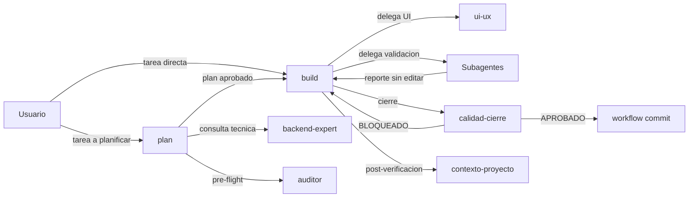
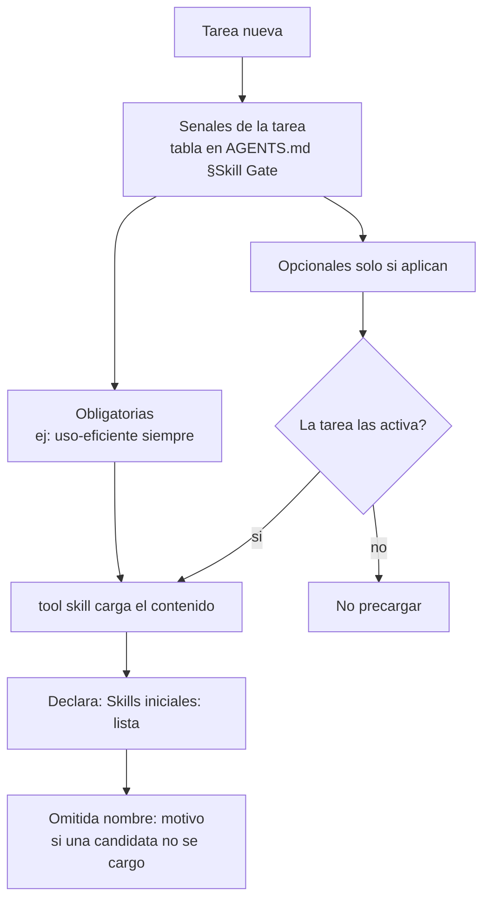
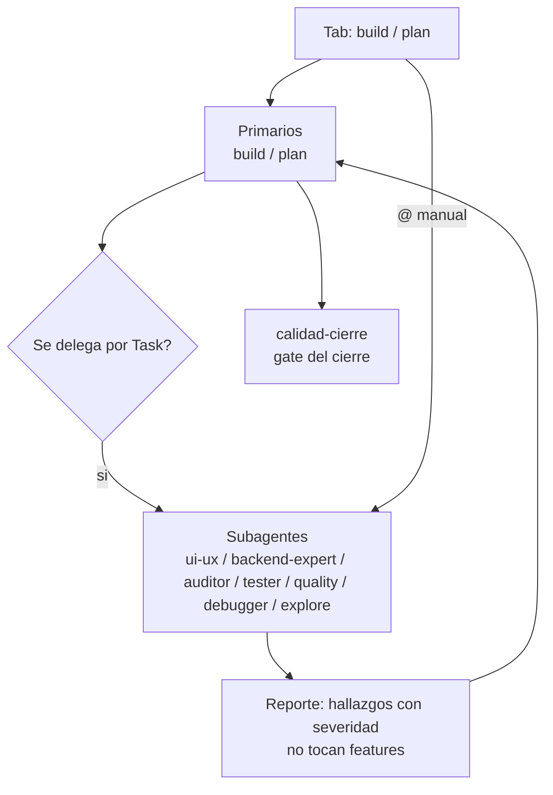
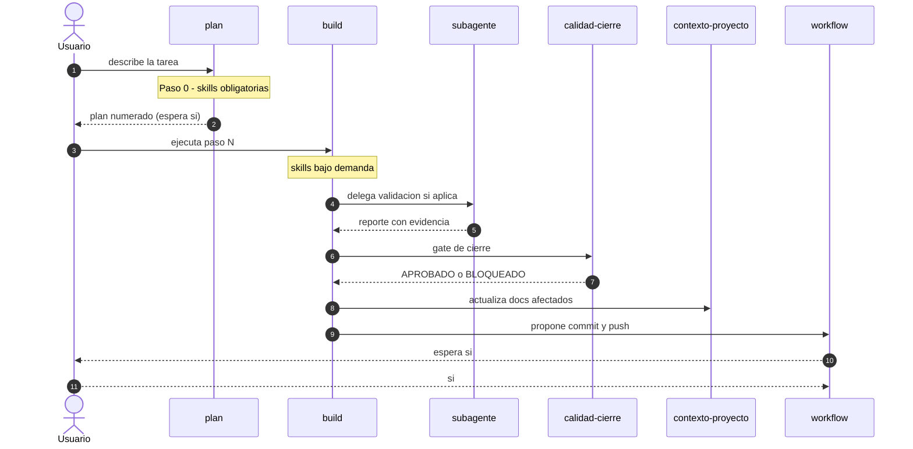
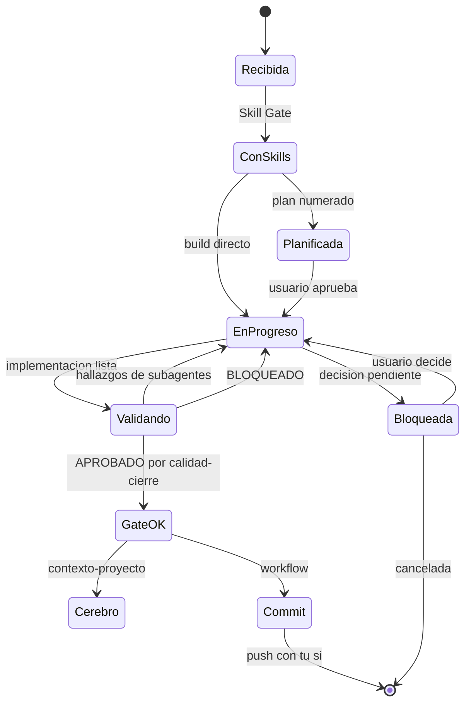
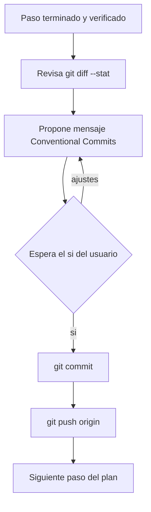
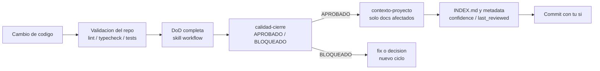

# Pipeline de ejecucion de tareas — OpenCode

> **Fecha:** 2026-09-19 · **Actualizado:** 2026-09-24 (roles reales + referencias por seccion) · **Estado:** vigente · **Para quien:** dev junior con TDAH — secciones cortas, tablas y diagramas; leer en 5 min.
> **Estado del harness:** los 2 primarios son `build` y `plan`; `ui-ux` y `backend-expert` son subagents (se lanzan con `@` o los delega un primario). El inventario vigente esta en [estado-actual-harness.md](estado-actual-harness.md); la [auditoria v2](auditoria-skills-agentes-v2.md) es historica (2026-09-18).
> Regla de esta doc: **enlazar, no copiar**. La tabla del Skill Gate vive en `AGENTS.md` §Skill Gate; aqui solo se referencia. Las referencias usan seccion, no linea: las lineas se pudren.

## 2. Pipeline por actor

Quien hace que, y quien decide cada transicion.

<b>Fase 1 — Usuario inicia</b>

- Abre un primario en Tab: `build` (implementar) o `plan` (planificar). Lanza un subagent suelto con `@` — `AGENTS.md` §Agentes.
- Regla practica: todo entra por un primario — programar → `build` · UI → `build` delega a `ui-ux` · arquitectura → `plan` consulta a `backend-expert` · docs → `build` delega a `auditor`.
- Color de ayuda: `build` verde, `plan` azul; si ves el color equivocado, la sesion cargo otra config (reinicia).

<b>Fase 2 — plan (si la tarea lo amerita)</b>

- Planifica con evidencia del repo; **nunca edita** (frontmatter `plan.md`).
- Cada paso del plan es una unidad de commit; delega dudas de arquitectura a `backend-expert` — `plan.md:14-33`.

<b>Fase 3 — build implementa y delega la UI</b>

- `build`: features, bugs, refactors con DoD — `build.md` §Orquestacion.
- `ui-ux` (subagent): solo frontend, con flujo Impeccable obligatorio — `ui-ux.md` §Flujo de diseno.
- Ambos aplican el Skill Gate antes de leer/editar (Paso 0 en los 8 agentes).

<b>Fase 4 — Subagentes validan</b>

- `tester` (E2E browser), `auditor` (revision contra skills), `quality` (refactor/perf), `debugger` (causa raiz) — `AGENTS.md` §Agentes.
- Los subagentes **reportan o corrigen lo suyo**; ninguno implementa features ni invoca a otro agente (`task: deny`).

<b>Fase 5 — Gates y cierre</b>

- `calidad-cierre` emite `APROBADO`/`BLOQUEADO` al terminar (skill `calidad-cierre`).
- `contexto-proyecto` actualiza solo los docs afectados del cerebro.
- `workflow` cierra con commit propuesto y espera tu `si`.

## 3. Skill Gate — como se cargan las skills

Se cargan **por tarea**, no por reflexion ni todas juntas: contenido bajo demanda (meta: indice visible, cuerpo solo al cargar).

- Obligatoria vs opcional: tabla en `AGENTS.md` §Skill Gate.
- Anti-omision: si la description menciona el dominio de la tarea, se carga (regla anti-omision del §Skill Gate).
- Carga bajo demanda: `Skills: <cargadas>` + `Cargadas durante tarea:` si el alcance cambia (ritual del §Skill Gate).
- En toda tarea son obligatorias `uso-eficiente` y `comunicacion-asertiva`; las manuales (`habilidades-ofimaticas`, `informe-docx`, `notion-flow`) solo con invocacion explicita.

## 4. Routing — primarios vs subagentes

| Agente | Modo | Puede editar | Uso tipico |
| --- | --- | --- | --- |
| `build` | primary | codigo ✓ | implementar/fixear |
| `plan` | primary | nada | planificar, pre-commit del diseño |
| `ui-ux` | subagent | solo frontend | UI/UX + Impeccable (lo delega `build`) |
| `backend-expert` | subagent | nada | análisis de dominio (lo consultan `plan` o `build`) |
| `auditor` | subagent | solo `*.md` | revisión pre-merge |
| `tester` | subagent | nada | E2E con browser |
| `quality` | subagent | codigo ✓ | refactor/perf medido |
| `debugger` | subagent | codigo ✓ | bugfix con regresion |

- Regla de oro: quien puede editar codigo → `build`, `ui-ux`, `quality`, `debugger`; quien no → `plan`, `backend-expert`, `tester`; `auditor` solo `*.md`.
- Permisos exactos por agente: [seccion 9](#sec-9) y frontmatter de cada `.md`.

## 5. Ciclo temporal de una tarea

- El plan se aprueba antes de tocar codigo: `plan.md` §Al entregar el plan.
- El commit **nunca** se ejecuta sin tu `si`: skill `workflow` (seccion "Commits por paso de plan").

## 6. Estados de una tarea

Estados clave: `Bloqueada` solo aparece si hay decision pendiente del usuario; todo bloqueo llega con evidencia completa (excepcion del estilo) — `AGENTS.md` §Estilo de respuesta.

## 7. Loop de commit por paso

- Mensajes: `feat:`/`fix:`/`chore:`/`docs:`/`refactor:` — descriptivos y autocontenidos, sin referencias internas del plan (skill `workflow`).
- En este repo: `main` versiona la plantilla hacia `darman-prog/HarnessConfig`; commits por paso, cada push validado por ti.
- Si el paso queda roto a medias, no se commitea: el commit es checkpoint de paso completo.

## 8. Cierre: DoD + gate + cerebro

- DoD canonica: skill `workflow` §Definition of Done (incluye el detector local `.opencode/skills/impeccable/scripts/impeccable.cmd detect` si tocaste UI).
- Gate: `APROBADO`/`BLOQUEADO` con evidencia — enlazado en la auditoria v2, [seccion 5](auditoria-skills-agentes-v2.md#5-ciclo-de-vida-de-una-feature).
- Cerebro: mapeo cambio → documentos en `contexto-proyecto/SKILL.md:87-97`; nunca se inventan decisiones (`confidence: supuesto` si falta evidencia).

## 9. Permisos por agente

| Nivel | Agentes | Que editan | Referencia |
| --- | --- | --- | --- |
| Base (todo agente) | los 8 | `edit` segun rol, `bash: ask` + git read `allow`, `skill: allow`, `task` segun rol | frontmatter de cada `.md` |
| Implementan codigo | `build`, `quality`, `debugger` | codigo ✓ | frontmatter de `build.md`, `quality.md`, `debugger.md` |
| Solo frontend | `ui-ux` | codigo frontend ✓ | frontmatter de `ui-ux.md` |
| Solo docs | `auditor` | solo `*.md` | frontmatter de `auditor.md` |
| Nunca editan | `plan`, `backend-expert`, `tester` | nada (deny) | frontmatter de `plan.md`, `tester.md`, `backend-expert.md` |
| Quien delega | `build` → los 7 subagents · `plan` → `backend-expert`, `auditor`, `explore` · subagents → nadie | `permission.task` | `task:` del frontmatter |

- Cada agente refuerza el Skill Gate en su "Paso 0" (8 archivos, mismo texto).
- El MCP Playwright solo se activa con el perfil `opencode.qa.json` (opt-in por proyecto); Notion con `opencode.notion.json` — ninguno es global.

## 10. Fricciones y bugs conocidos del pipeline

| # | Friccion | Efecto | Estado |
| --- | --- | --- | --- |
| a | `uso-eficiente` perdió su frontmatter (sin `name`/`description`) | El registry filtraba la skill en silencio → "no existe" en sesiones nuevas pese a ser obligatoria | **Detectada 2026-09-19, corregida el mismo dia** (frontmatter restaurado, commit `d72e6ae`) |
| b | Copia anidada stale `inicio-proyecto/inicio-proyecto/` en el global | El loader tomaba la version vieja (sin "Paso 0") sobre la vigente | **Detectada 2026-09-19, corregida** (anidado borrado + sync verificado) |
| c | `robocopy /E` en `sync-global.ps1` no purga extras | Los duplicados sobrevivian al sync sin aviso | **Corregida** con guardarraíl en `sync-global.ps1` (duplicados y skills sin `name` → `WARN` + `exit 1`; commit `a612820`) |

Notas honestas:

- Los fixes no eran "planificados pendientes": se aplicaron el mismo dia que se detectaron (ver historial de commits en `darman-prog/HarnessConfig`). Esta doc registra el estado **post-fix**.
- Clase de riesgo residual: proyectos con copias locales stale de skills/agentes pueden seguir sombreando al global; el escaneo de `PaginasWeb` (6 proyectos) limpio ese caso el 2026-09-19, pero otros entornos no se escanean automaticamente.
- El guardarrail solo valida el global (`$dst\skills`), no proyectos individuales.

## Verificacion y cierre

- 7 diagramas Mermaid (flowchart x5, sequenceDiagram, stateDiagram-v2) con sintaxis validada manualmente; los anchors `#sec-*` existen en este archivo.
- Sin lint/tests aplicables (documento markdown): validacion = conteo de diagramas + sintaxis mermaid revisada nodo a nodo.
- Actualizado 2026-09-24: 2 primarios + 7 subagents, `plan` con pre-flight de `auditor`, referencias por seccion (las de linea se pudren) y el detector de `impecable` sin `npx`. Inventario vigente: [estado-actual-harness.md](estado-actual-harness.md).
